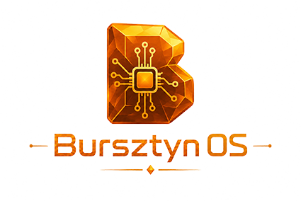
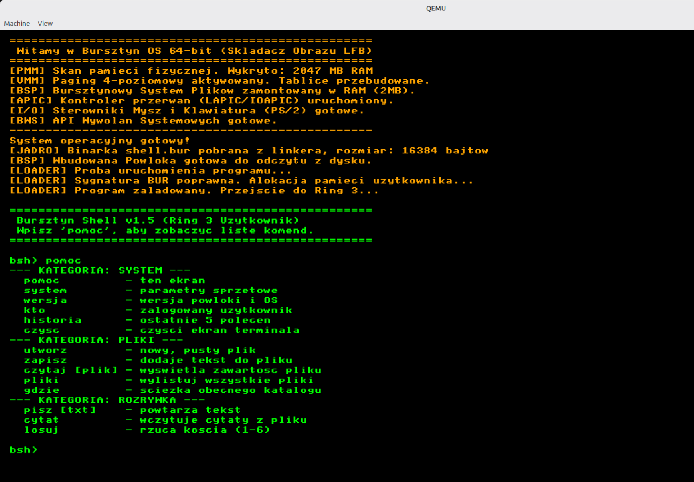
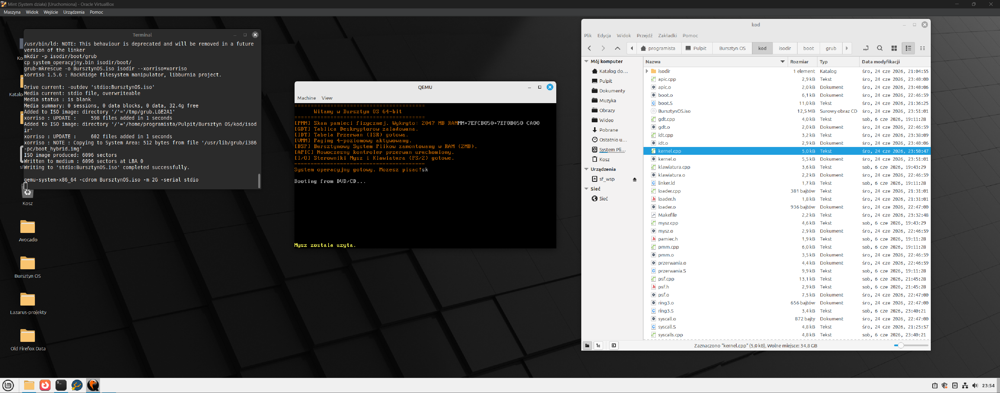

# Dokumentacja Systemu Operacyjnego Bursztyn OS



Witaj w oficjalnej dokumentacji **Bursztyn OS** – niezależnego, 64-bitowego systemu operacyjnego z polską duszą inżynieryjną, tworzonego całkowicie od zera (czysty bare-metal).

System jest rozwijany z myślą o architekturze x86-64, implementując własne Jądro, autorski system plików, niezależny logiczny model bezpieczeństwa oraz natywne środowisko uruchomieniowe dla programów skompilowanych z języka Avocado.

# Program  powłoka systemowa shell


## Dostępne 14 komend w Shellu
1. pomoc - wyświetla dostępną listę komend.
1. system - wypisuje informacje o architekturze Bursztyn OS.
1. wersja - krótka informacja o wersji powłoki i OS
1. kto - odpowie, na jakich prawach aktualnie działasz.
1. historia – pokaże 5 ostatnich wpisanych przez Ciebie poleceń!
1. czysc - czyści ekran terminala
1. utworz - tworzy nowy, pusty plik na RAM-Dysku.
1. zapisz - zapisuje plik
1. czytaj [plik] - wyświetla zawartość pliku  
1. pliki - wylistuj wszystkie pliki
1. gdzie - ścieżka obecnego katalogu
1. pisz [tekst] - wypisze z powrotem na ekran to, co wpiszesz po spacji.
1. cytat - wypisze losowy, motywujący cytat programistyczny.
1. losuj - rzuci wirtualną sześciościenną kością.

    

## 🗂️ Struktura Dokumentacji

Poniższe pliki zawierają pełną specyfikację techniczną, opisy mechanizmów oraz analizę kodu źródłowego systemu:

1. [01_wstep_i_filozofia.md](docs/01_wstep_i_filozofia.md) – Wizja projektu, założenia ideologiczne, polskie nazewnictwo i roadmapa rozwoju.
2. [02_architektura_systemu.md](docs/02_architektura_systemu.md) – Podział na przestrzenie Ring 0/Ring 3, szczegółowa specyfikacja modelu BZL (Bursztynowy Poziom Zaufania) oraz wprowadzenie do BWS.
3. [03_proces_rozruchu.md](docs/03_proces_rozruchu.md) – Analiza `boot.S`, wielopoziomowe tablice stron, przejście do trybu Long Mode i przekazanie parametrów z GRUB.
4. [04_zarzadzanie_sprzetem.md](docs/04_zarzadzanie_sprzetem.md) – Inicjalizacja GDT, IDT, kontroler APIC, Zegar Systemowy (LAPIC Timer) oraz sterowniki wejścia/wyjścia (klawiatura PS/2, ekran tekstowy).
5. [05_bursztynowy_system_plikow.md](docs/05_bursztynowy_system_plikow.md) – Specyfikacja BSP, struktura węzłów indeksowych, parser ścieżek i implementacja RAM-dysku.
6. [06_wywolania_systemowe.md](docs/06_wywolania_systemowe.md) – Architektura BWS, Standard BWS dla rejestrów (R8-R13) i wykaz dostępnych wywołań systemowych.
7. [07_ekosystem_i_formaty.md](docs/07_ekosystem_i_formaty.md) – Specyfikacja binarna `.bur`, struktura paczek `.cebula` oraz manifesty `opis.aplikacji`.
8. [08_bursztynowy_slownik_i_architektura.md](docs/08_bursztynowy_slownik_i_architektura.md) – Oficjalny słownik pojęć rdzennych (Teczka, Włókna, Planista) oraz strategia pełnego wdrożenia UTF-8.

## 🛠️ Architektura w pigułce

* **Tryb procesora:** 64-bit Long Mode (wymagany start z GRUB za pomocą Multiboot2).
* **Zarządzanie pamięcią:** Zarządca Pamięci Fizycznej (mapa bitowa) + Zarządca Pamięci Wirtualnej (4-poziomowe stronicowanie PML4/PDP/PD/PT).
* **Wielozadaniowość/Asynchroniczność:** Nowoczesny APIC + Zegar LAPIC (Wektor 32) po całkowitym uśpieniu archaicznego PIC.
* **System plików:** BSP (Bursztynowy System Plików) – bloki 512 B, drzewo teczek oparte na węzłach indeksowych.

# Jak uruchomić system Burstzyn w QEMU na Windows 11
## Krok 1: pobierz plik BursztynOS.iso na pc, otwórz wiersz polecenia cmd
Naciśnij na klawiaturze skrót Win + R, wpisz cmd i wciśnij Enter.
## Krok 2: Przejście do folderu z systemem
Wpisz po kolei te dwie komendy (każdą zatwierdź Enterem), aby przełączyć się na dysk D: czy C: i wejść do katalogu z najnowszym wydaniem:
```
D:
cd D:\Bursztyn-OS\
```

## Krok 3: Uruchomienie QEMU
Będąc już w folderze, w którym leży plik BursztynOS.iso, odwołaj się do programu zainstalowanego na dysku C:. Skopiuj całą tę linijkę (z zachowaniem cudzysłowów) i wklej do konsoli:
```
"C:\Program Files\qemu\qemu-system-x86_64.exe" -cdrom BursztynOS.iso -m 2G
```
## Jeżeli są błędy przy uruchomieniu
### Błąd akceleracji (Hyper-V / WHPX)
Jak to wygląda: failed to initialize WHPX: No accelerator found lub Could not initialize KVM.

Dlaczego? Na tym komputerze z Windowsem nie jest włączona sprzętowa wirtualizacja (Hyper-V). QEMU próbuje użyć szybkiego trybu, ale system mu na to nie pozwala.

Rozwiązanie: Uruchom Bursztyn OS w trybie podstawowym (emulacji programowej), po prostu usuwając parametr -accel whpx:
```
"C:\Program Files\qemu\qemu-system-x86_64.exe" -cdrom BursztynOS.iso -m 2G
```

## 2. Brak pliku ISO w danym folderze
Jak to wygląda: qemu-system-x86_64.exe: -cdrom BursztynOS.iso: Could not open 'BursztynOS.iso': No such file or directory

Dlaczego? Konsola CMD jest otwarta w innym folderze, niż ten, w którym fizycznie leży Twój plik .iso (lub nazwa pliku różni się wielkością liter/ma dopisaną jakąś cyfrę).

Rozwiązanie: Upewnij się komendą dir, że w wierszu poleceń na pewno jesteś w odpowiednim folderze i że plik z systemem tam jest.

##  3. Problem ze spacją (zgubione cudzysłowy)
Jak to wygląda: 'C:\Program' is not recognized as an internal or external command, operable program or batch file.

Dlaczego? Jeśli w CMD wpiszesz ścieżkę ze spacją bez cudzysłowów, konsola utnie ją na słowie Program i spróbuje to uruchomić, ignorując resztę.

Rozwiązanie: Bezwzględnie pamiętaj o znakach " na początku i końcu ścieżki do QEMU.

# Jak uruchomić system Burstzyn w QEMU na Linux Mint
## Krok 1: Otwórz terminal w folderze z plikiem
Najszybsza metoda w systemach takich jak Linux Mint:

1. Otwórz menedżera plików i wejdź do folderu, w którym leży BursztynOS.iso.

2. Kliknij prawym przyciskiem myszy w puste miejsce w tym folderze.

3. Wybierz opcję "Otwórz w terminalu" (Open in Terminal).

(Alternatywnie możesz użyć komendy cd, np. cd ~/Pulpit/Bursztyn\ OS/kod).

## Krok 2: Wpisz komendę uruchamiającą
1. W Linuksie program QEMU jest dodany do globalnych ścieżek systemu, więc nie musisz podawać do niego pełnej ścieżki w cudzysłowach tak jak na Windowsie. 
1. Po prostu wklej to:
```

qemu-system-x86_64 -cdrom BursztynOS.iso -m 2G
```

### Krok 3: (Opcjonalnie) Włącz dopalacze KVM! 🚀
Na Windowsie próbowaliśmy włączyć akcelerację WHPX, ale to na Linuksie QEMU rozwija prawdziwe skrzydła dzięki natywnej akceleracji KVM (Kernel-based Virtual Machine). Zamiast emulować procesor programowo, system pozwala wirtualnej maszynie używać Twojego fizycznego procesora. Bursztyn OS uruchomi się wtedy z prędkością światła!

Aby to zrobić, po prostu dodaj flagę -enable-kvm:
```
qemu-system-x86_64 -enable-kvm -cdrom BursztynOS.iso -m 2G
```

## Uruchomiony system Bursztyn OS na Linux Mint w QEMU


# Kompilowanie systemu ze źródel na Linux Mint i uruchomienie w QEMU 
### Przygotowanie Środowiska w Linux Mint
1. Otwórz natywny terminal i wykonaj te trzy polecenia:
1. Aktualizacja repozytoriów:
```
sudo apt update && sudo apt upgrade -y
```

2. Instalacja narzędzi budujących i kompilatora skrośnego: Narzędzie build-essential dostarczy nam program make, a pakiety g++ pozwolą kompilować kod.
sudo apt install build-essential gcc-x86-64-linux-gnu g++-x86-64-linux-gnu -y

3. Instalacja narzędzi do tworzenia obrazu ISO (Multiboot)
Aby komenda grub-mkrescue działała bezbłędnie podczas budowania obrazu .iso  systemu Bursztyn OS, musisz doinstalować te pakiety:
```
sudo apt install xorriso mtools grub-pc-bin grub-common -y
```

4. Emulator do szybkich testów (Opcjonalnie)
Zamiast za każdym razem uruchamiać cięższe środowiska i przeklikiwać się przez interfejs VirtualBoxa, w systemie Linux Mint możesz zainstalować lekki emulator QEMU. Pozwala on na błyskawiczne uruchomiać system bezpośrednio z terminala za pomocą jednej komendy (np. qemu-system-x86_64 -cdrom BursztynOS.iso).
Aby zainstalować QEMU, wpisz w terminalu:
```
sudo apt install qemu-system-x86 -y
```


5. Wybór Edytora Kodu
    1. Możesz użyć wbudowanego w Minta lekkiego programu Xed.
    1. Możesz pobrać Visual Studio Code (wersję natywną dla Linuxa, instalowaną z pakietu .deb).
    1. Możesz użyć dowolnego innego narzędzia (np. Vim, Nano, CLion), w którym pisze Ci się wygodnie.
Skrypt Makefile i tak zajmie się całą "magią" kompilacji i budowania pliku ISO w tle, niezależnie od tego, w jakim programie edytujesz pliki źródłowe.


Aby w pełni skompilować kod Bursztyn OS i uruchomić go na maszynie wirtualnej, musisz połączyć wygenerowany plik binarny z programem rozruchowym GRUB (zgodnie ze standardem Multiboot2) i stworzyć obraz ISO.
Oto instrukcja krok po kroku, jak to zrobić na Twoim systemie Linux Mint:
## Krok 1: Dostosowanie Makefile do kompilatorów w Linux Mint
Makefile narzędzia są zdefiniowane jako standardowy cross-compiler x86_64-elf:

```
CC = x86_64-elf-g++
AS = x86_64-elf-as
LD = x86_64-elf-ld
```

## Krok 2: Kompilacja Jądra Bursztyna
Otwórz terminal w folderze, w którym znajduje się Twój plik Makefile i kod źródłowy, a następnie wpisz:
make

Skrypt automatycznie skompiluje pliki boot.o, gdt.o, pmm.o, vmm.o, kernel.o itd. i połączy je za pomocą Twojego skryptu linker.ld. Jeśli nie ma błędów w kodzie, w folderze pojawi się plik system_operacyjny.bin.
## Krok 3: Przygotowanie struktury pliku ISO (GRUB Multiboot2)
Bursztyn OS operuje w 64-bitowym Long Mode, więc wymaga programu rozruchowego (GRUB), który przekaże parametry Multiboot2. Musisz zbudować prostą strukturę teczek dla obrazu płyty:
W terminalu utwórz katalogi: 
```
mkdir -p isodir/boot/grub 
```
Skopiuj swoje skompilowane jądro do katalogu /boot: 
```
cp system_operacyjny.bin isodir/boot/ 
```

Stwórz plik konfiguracyjny GRUBa o nazwie grub.cfg (np. za pomocą xed isodir/boot/grub/grub.cfg lub nano isodir/boot/grub/grub.cfg) i wklej do niego ten kod: 

set timeout=0
set default=0

menuentry "Bursztyn OS" {
    multiboot2 /boot/system_operacyjny.bin
    boot
}

## Krok 4: Generowanie bootowalnego obrazu ISO
Mając gotową strukturę (isodir), użyj zainstalowanego wcześniej narzędzia grub-mkrescue, aby "zamknąć" to w plik .iso:

grub-mkrescue -o BursztynOS.iso isodir 

W głównym folderze pojawi się nowy plik BursztynOS.iso.

## Krok 5: Uruchomienie w QEMU
Teraz czas ożywić polski system operacyjny! Użyj QEMU, ładując wygenerowany obraz płyty:
```
qemu-system-x86_64 -cdrom BursztynOS.iso -m 2G -serial stdio
```

(Flaga -m 2G przydziela 2 Gigabajty pamięci RAM dla maszyny, co przyda się przy testowaniu Zarządcy Pamięci (PMM/VMM) w Etapie 3, a -serial stdio pozwala kierować logi z jądra bezpośrednio do Twojego terminala Linux).
Po wykonaniu tej komendy powinno wyskoczyć okno emulatora wyświetlające GRUB, a zaraz po nim kod z pliku kernel.cpp Bursztyn OS! 


Komenda make clear - usuwa pliki .o
```
make clear
```

Skompiluj wszystko od nowa wpisując: 

make 

Teraz kompilator przejdzie przez wszystkie moduły (włącznie z systemem plików psf.o i urządzeniami), a na końcu wyświetli Ci poprawnie sklejony plik system_operacyjny.bin, który będziesz mógł podpiąć do GRUBa za pomocą komendy 


Ostatnie kroki w terminalu:
Wpisz po kolei te polecenia 
1. Skompiluj kod:
```
make
```
2. Skopiuj wygenerowany obraz do struktury wirtualnej płyty:
```
cp system_operacyjny.bin isodir/boot/
```
3. Stwórz plik ISO:
```
grub-mkrescue -o BursztynOS.iso isodir
```
lub
```
grub-mkrescue -o BursztynOS.iso isodir --xorriso=xorriso
```
4. Uruchom system!:
```
qemu-system-x86_64 -cdrom BursztynOS.iso -m 2G -serial stdio
```

ewentualnie po prostu wpisz ```make run``` i wszystko się zrobi automatycznie
```
make run 
```
